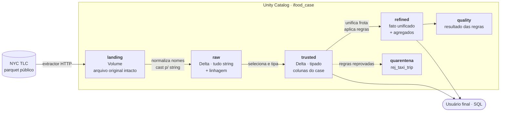

# Case Técnico Data Architect — corridas de táxi de NY

Pipeline de ingestão, modelagem e análise das corridas de táxi da cidade de Nova York
(NYC TLC), de **janeiro a maio de 2023**, construído em PySpark sobre Databricks com
arquitetura em camadas e Delta Lake.

O que o pipeline entrega:

* os arquivos originais preservados em uma landing zone;
* tabelas Delta consultáveis por SQL na camada de consumo;
* um fato unificado da frota (yellow + green) com qualidade de dados aplicada e
  auditável;
* as respostas às duas perguntas do case, com a ambiguidade de cada enunciado
  explicitada e resolvida.

---

## Sumário

* [Arquitetura](#arquitetura)
* [Modelo de dados](#modelo-de-dados)
* [Decisões técnicas](#decisões-técnicas)
* [Qualidade de dados](#qualidade-de-dados)
* [Como executar](#como-executar)
* [Testes](#testes)
* [Estrutura do repositório](#estrutura-do-repositório)
* [Respostas do case](#respostas-do-case)
* [Limitações e próximos passos](#limitações-e-próximos-passos)

---

## Arquitetura



Cada camada tem um contrato explícito:

| Camada | Formato | Contrato |
|---|---|---|
| `landing` | Parquet original (Volume) | Byte a byte como veio da TLC. Nada é transformado. Permite reprocessar tudo do zero sem depender do site da origem. |
| `raw` | Delta | Espelho da origem. Nomes em snake_case, **todas as colunas de origem em `string`**, colunas de linhagem, particionada pelo mês de competência do arquivo. Nenhuma linha descartada. |
| `trusted` | Delta | Camada de consumo. Apenas as colunas exigidas pelo case, com a grafia exigida e os tipos corretos. Ainda **sem filtros**. |
| `refined` | Delta | Fato unificado da frota, já submetido às regras de qualidade, mais agregados analíticos. |
| `quality` | Delta | Resultado da última execução das regras — quantas linhas cada regra reprovou. |

---

## Modelo de dados

### `trusted.ny_taxi_trip_yellow` / `..._green`

| Coluna | Tipo | Descrição |
|---|---|---|
| `VendorID` | `bigint` | Provedor do registro (1 = Creative Mobile, 2 = Curb/VeriFone) |
| `passenger_count` | `double` | Passageiros informados pelo motorista |
| `total_amount` | `double` | Valor total cobrado do passageiro, em US$ |
| `tpep_pickup_datetime` / `lpep_pickup_datetime` | `timestamp` | Início da corrida |
| `tpep_dropoff_datetime` / `lpep_dropoff_datetime` | `timestamp` | Fim da corrida |
| `_source_file` | `string` | Caminho do arquivo de origem (linhagem) |
| `_ingested_at` | `timestamp` | Momento da ingestão |
| `ref_year`, `ref_month` | `string` | Partição: mês de **competência do arquivo** |

O prefixo `tpep`/`lpep` é preservado porque é a nomenclatura da própria TLC e é o que
o enunciado do case pede explicitamente para o yellow.

### `refined.fct_taxi_trip`

Fato unificado da frota. Colunas adicionais em relação à trusted:

| Coluna | Tipo | Descrição |
|---|---|---|
| `trip_type` | `string` | `yellow` ou `green` — discriminador da frota |
| `pickup_datetime`, `dropoff_datetime` | `timestamp` | Nomes canônicos, independentes do tipo de táxi |
| `trip_duration_minutes` | `double` | Duração calculada da corrida |
| `pickup_year`, `pickup_month` | `string` | Partição: mês do **evento** |
| `pickup_hour` | `int` | Hora do embarque (0–23) |
| `pickup_date` | `date` | Data do embarque |

### Tabelas derivadas

| Tabela | Para que serve |
|---|---|
| `refined.rej_taxi_trip` | Quarentena: linhas reprovadas, com `_rejection_reasons` |
| `refined.agg_trip_monthly` | Receita, ticket médio e mediana por tipo e mês |
| `refined.agg_trip_hourly` | Corridas e passageiros por tipo, mês e hora do dia |
| `quality.dq_results` | Uma linha por regra: avaliadas, reprovadas, % |

---

## Decisões técnicas

**Por que uma camada só de `string` na raw.**
A TLC muda o tipo físico das colunas entre meses do mesmo ano — `airport_fee` é `int64`
em 2023-01 e `double` a partir de 2023-02. Ler os cinco arquivos juntos falha. Materializar
a raw com tudo em `string` faz a ingestão sobreviver a qualquer mudança de tipo na origem;
a tipagem correta fica concentrada em um único lugar, a trusted, onde temos controle do
schema final.

**Por que normalizar os nomes de coluna.**
A mesma coluna aparece como `airport_fee` em janeiro e `Airport_fee` nos meses seguintes.
Depender de `spark.sql.caseSensitive=false` é depender de uma configuração de sessão que
alguém pode mudar. Normalizamos para snake_case na raw e restauramos a grafia exigida pelo
case (`VendorID`) no mapeamento da trusted — explícito e testado.

**Por que `ref_year`/`ref_month` são diferentes de `pickup_year`/`pickup_month`.**
O mês do arquivo não é o mês da corrida. Os arquivos da TLC contêm registros com data de
2001, 2008 e até 2090, e também corridas de meses vizinhos. Misturar as duas coisas produz
um bug silencioso clássico: um `GROUP BY mês do pickup` sem filtro devolve linhas fantasma
no resultado. Raw e trusted particionam pela competência do arquivo (é o que governa o
reprocessamento); a refined particiona pelo mês do evento (é o que governa a análise).

**Por que `replaceWhere` e não `partitionOverwriteMode=dynamic`.**
O modo dinâmico depende de uma configuração de sessão do Delta e, quando ela não está
habilitada, degrada para um overwrite **total** da tabela — em silêncio. O `replaceWhere`
declara no predicado exatamente qual fatia está sendo substituída. O pipeline pode ser
reexecutado quantas vezes for necessário, para a janela toda ou para um mês só, sempre
com o mesmo resultado.

**Por que uma camada `refined` além da `trusted`.**
O case exige a trusted com colunas específicas por tipo de táxi, mas duas das perguntas
falam de "toda a frota". Sem uma camada de unificação, todo analista teria que escrever
`UNION ALL` na mão e lembrar que yellow usa `tpep_` e green usa `lpep_`. A `fct_taxi_trip`
resolve isso uma vez, no pipeline.

**Por que quarentena em vez de `WHERE`.**
Filtrar linha ruim direto na query esconde a decisão dentro do SQL de quem analisa. Aqui a
linha reprovada vai para `rej_taxi_trip` carregando o motivo. Dá para medir quanto foi
retirado, auditar se a regra estava certa e reincorporar depois — por exemplo, se a área de
negócio confirmar que os `total_amount` negativos são estornos que devem compor a receita.

**Por que funções puras separadas de I/O.**
Toda a lógica de transformação está em `src/processing/transformations.py` e
`src/quality/expectations.py` como funções que recebem e devolvem `DataFrame`. Isso permite
testar as regras com `pytest` em um Spark local, sem cluster e sem Delta — o que é o motivo
de existir uma suíte de testes rodando em CI para um projeto de dados.

---

## Qualidade de dados

Regras aplicadas na transição trusted → refined:

| Regra | Bloqueante | O que barra |
|---|---|---|
| `pickup_datetime_nulo` | sim | Corrida sem horário de início |
| `dropoff_datetime_nulo` | sim | Corrida sem horário de término |
| `duracao_nao_positiva` | sim | Término anterior ou igual ao início |
| `duracao_acima_de_24h` | sim | Duração implausível para táxi urbano |
| `fora_da_janela_de_analise` | sim | Pickup fora de Jan–Mai/2023 (datas corrompidas na origem) |
| `total_amount_nulo` | sim | Sem valor não há como compor receita |
| `total_amount_negativo` | sim | Provável estorno; vai para quarentena e é analisado à parte |
| `passenger_count_ausente` | **não** | Contagem nula ou zero. A corrida continua valendo para receita; só as análises de passageiro filtram |

A distinção entre bloqueante e não bloqueante é o ponto: uma corrida sem `passenger_count`
ainda é uma corrida com receita legítima. Descartá-la da análise de faturamento enviesaria
o resultado em troca de nada.

---

## Como executar

### Pré-requisitos

Uma conta no **[Databricks Free Edition](https://www.databricks.com/learn/free-edition)**.

> O enunciado do case sugere o Databricks Community Edition, mas o Community Edition foi
> descontinuado em 1º de janeiro de 2026 e substituído pelo Free Edition. O Free Edition
> tem Unity Catalog, Volumes e compute serverless, que é justamente o que este projeto usa —
> o Community Edition nunca teve Unity Catalog.

> **Acesso à internet.** O Free Edition restringe a saída de rede a um conjunto de domínios
> confiáveis, e o CDN da TLC não está nessa lista. Duas saídas: verificar a conta com o
> LinkedIn (libera acesso externo e faz o download automático funcionar), ou usar o
> **plano B de upload manual** documentado no próprio `01_landing.ipynb` — baixar os 10
> arquivos no navegador, enviá-los para o Volume e rodar a célula que os organiza no layout
> particionado. O resultado é idêntico nos dois caminhos.

### Passo a passo

1. **Importe o repositório.** No workspace do Databricks: `Workspace` → `Create` →
   `Git folder` → cole a URL deste repositório.
2. **Rode `src/notebooks/00_setup.ipynb`.** Cria o catálogo `ifood_case`, os cinco schemas
   e o Volume da landing. Só precisa rodar uma vez.
   *Se sua conta não permitir `CREATE CATALOG`, troque a constante `CATALOG` em
   `src/config.py` para `workspace` e rode apenas os comandos de schema e volume.*
3. **Rode os notebooks do pipeline, em ordem:**

   | Notebook | O que faz | Tempo aproximado |
   |---|---|---|
   | `src/notebooks/01_landing.ipynb` | Baixa os 10 parquets da TLC para o Volume | 3–6 min |
   | `src/notebooks/02_raw.ipynb` | Materializa as tabelas raw em Delta | 2–4 min |
   | `src/notebooks/03_trusted.ipynb` | Aplica o schema de consumo | 1–3 min |
   | `src/notebooks/04_refined.ipynb` | Fato unificado, quarentena, DQ e agregados | 3–6 min |

4. **Rode as análises:**

   | Notebook | O que faz |
   |---|---|
   | `analysis/01_analise_exploratoria.ipynb` | Perfil dos dados, anomalias e o efeito das regras |
   | `analysis/02_respostas.ipynb` | As respostas às perguntas do case |

5. **Preencha `analysis/RESULTADOS.md`** com os números obtidos.

### Reprocessamento

Todos os passos são idempotentes. Para recarregar apenas um mês, ajuste
`INGESTION_START` / `INGESTION_END` em `src/config.py` e rode os notebooks 01 a 04
novamente: o `replaceWhere` substitui somente as partições afetadas.

### Consumindo os dados

Depois do pipeline, qualquer usuário consulta via SQL Editor:

```sql
-- Camada de consumo, por tipo de táxi
SELECT VendorID, passenger_count, total_amount,
       tpep_pickup_datetime, tpep_dropoff_datetime
FROM ifood_case.trusted.ny_taxi_trip_yellow
LIMIT 100;

-- Fato unificado da frota
SELECT trip_type, pickup_datetime, passenger_count, total_amount
FROM ifood_case.refined.fct_taxi_trip
WHERE pickup_year = '2023' AND pickup_month = '05'
LIMIT 100;
```

---

## Testes

A lógica de transformação e as regras de qualidade rodam em Spark local, sem Databricks:

```bash
pip install -r requirements.txt
pytest
ruff check src tests
```

Cobertura da suíte:

* normalização de nomes e o conflito real `airport_fee` / `Airport_fee`;
* união de arquivos com tipos físicos diferentes entre meses;
* aplicação de schema, incluindo falha explícita quando uma coluna obrigatória some;
* cada regra de qualidade, uma a uma, e o acúmulo de vários motivos na mesma linha;
* o fato de `passenger_count` ausente **não** bloquear a corrida;
* geração do predicado `replaceWhere`;
* calendário de ingestão e construção das URLs da TLC.

O workflow em `.github/workflows/ci.yml` roda lint e testes a cada push e pull request.

---

## Estrutura do repositório

```
ifood-case/
├─ src/
│  ├─ config.py                        # parâmetros centrais do pipeline
│  ├─ ingestion/
│  │  └─ ny_taxi_trip_extractor.py     # download HTTP → landing
│  ├─ processing/
│  │  ├─ transformations.py            # funções puras (testáveis)
│  │  ├─ landing_to_raw.py             # landing → raw
│  │  ├─ raw_to_trusted.py             # raw → trusted
│  │  └─ trusted_to_refined.py         # trusted → refined + agregados
│  ├─ quality/
│  │  └─ expectations.py               # regras de qualidade e quarentena
│  ├─ utils/
│  │  ├─ delta.py                      # escrita idempotente com replaceWhere
│  │  └─ logging.py                    # logging padronizado
│  └─ notebooks/
│     ├─ 00_setup.ipynb
│     ├─ 01_landing.ipynb
│     ├─ 02_raw.ipynb
│     ├─ 03_trusted.ipynb
│     └─ 04_refined.ipynb
├─ analysis/
│  ├─ 01_analise_exploratoria.ipynb
│  ├─ 02_respostas.ipynb
│  └─ RESULTADOS.md                    # resumo executivo dos números
├─ tests/
│  ├─ conftest.py
│  ├─ test_transformations.py
│  ├─ test_expectations.py
│  ├─ test_ingestion.py
│  └─ test_delta_utils.py
├─ .github/workflows/ci.yml
├─ pyproject.toml
├─ requirements.txt
└─ README.md
```

Os notebooks são apenas orquestradores finos: toda a lógica vive em módulos Python
versionados e testáveis. Nenhuma regra de negócio está escrita dentro de um notebook.

---

## Respostas do case

As duas perguntas do enunciado são ambíguas em português, e a ambiguidade muda o número.
`analysis/02_respostas.ipynb` responde as duas leituras de cada uma, com a recomendação
explícita de qual usar.

**Pergunta 1 — média de `total_amount` recebido em um mês (yellow).**

* *Ticket médio:* média do `total_amount` por corrida, quebrada por mês.
* *Faturamento médio mensal:* soma do mês, com média entre os cinco meses.

A segunda é a leitura literal do enunciado; a primeira é a métrica que a operação
normalmente acompanha. Acompanha ainda uma análise de sensibilidade mostrando quanto a
decisão de quarentenar os valores negativos altera o resultado.

**Pergunta 2 — média de `passenger_count` por hora do dia em maio (frota completa).**

* *Ocupação média:* média do `passenger_count` por corrida, em cada hora — a leitura direta.
* *Volume médio de passageiros:* total de passageiros da hora dividido pelos dias do mês —
  a leitura que serve para dimensionar operação.

"Toda a frota" foi interpretado como **yellow + green**. As bases FHV e High Volume FHV
(Uber, Lyft) não são táxis licenciados e sequer publicam `passenger_count`.

---

## Limitações e próximos passos

* **Orquestração.** Os notebooks rodam em sequência manual. O passo natural é um Databricks
  Job com dependência entre tarefas, ou um Asset Bundle versionado junto ao código.
* **Carga incremental.** Hoje a janela inteira é reprocessada a cada execução. Com histórico
  maior, o caminho é Auto Loader na landing e `MERGE` incremental nas camadas seguintes.
* **Particionamento.** Ano/mês acompanha o padrão de publicação da fonte e é adequado neste
  volume. Em escala maior, *liquid clustering* evitaria o problema de partições pequenas.
* **Contrato de schema.** As regras validam valores, não a estrutura. Um teste de contrato
  que falhe quando a TLC adicionar ou remover uma coluna fecharia o ciclo.
* **Fuso horário.** Os timestamps da TLC são horário local de Nova York e foram mantidos
  assim. Qualquer cruzamento com fonte externa precisa normalizar o fuso antes.
* **Documentação viva.** Comentários de tabela e coluna já são gravados no Unity Catalog;
  um passo adiante seria publicar isso como um catálogo de dados navegável.
